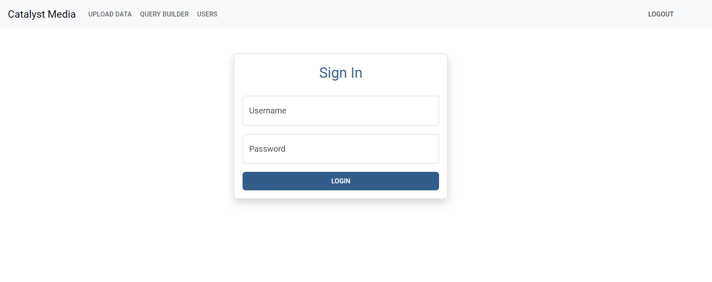
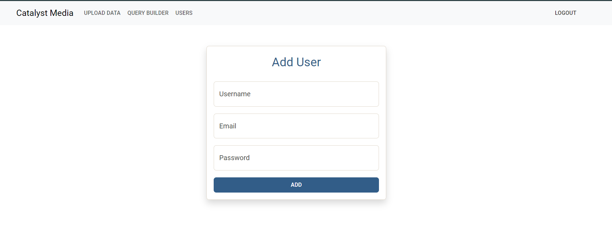
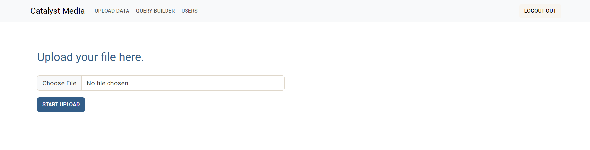
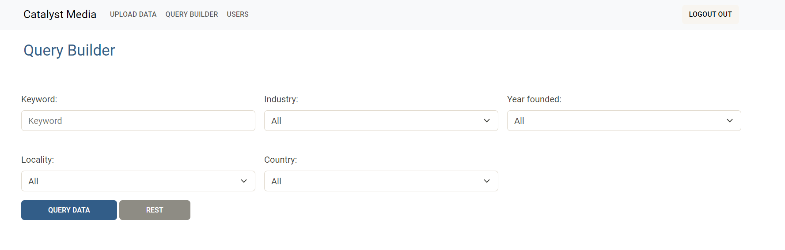
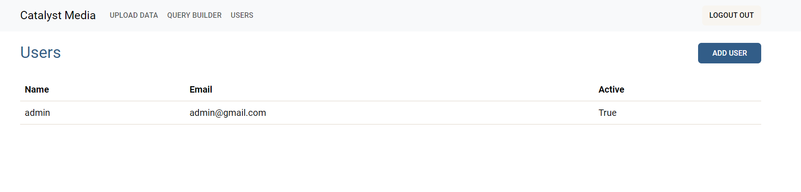

# catalyst_media

Tech Stack:

- Django 5
- Bootstrap 5
- PostgreSQL
- Application Overview:

This web application enables users to sign in, upload large volumes of data, and perform queries on the data. Files are divided into smaller chunks and uploaded to the server incrementally. The backend processes and saves these chunks asynchronously using threads, ensuring efficient handling and storage in the database.

## UI Design

